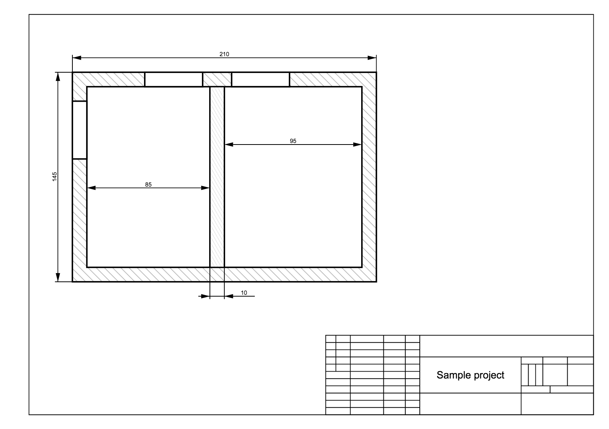

planner
=======

Python package for drawing 2d plans of a buildings.

Example of usage:
-----------------

```python
from planner.drawing import Drawing
from planner.frame.dimension import LinearDimension, ExtensionableLinearDimension, TinyExtensionableLinearDimension
from planner.frame.title import SampleTitle
from planner import frame
import subprocess
import os


d = Drawing("A3")
rect_frame = frame.RectFrame(x=50, y=50, width=210, height=145, wall_width=10, **{"stroke-width": "1"})
rect_frame.add_hatching(angle=45, distance=4, color="#999999", width=0.3)
rect_frame.add_aperture(50, 70, 40)
rect_frame.add_aperture(100, 50, 40)
rect_frame.add_aperture(160, 50, 40)
bulkhead2 = rect_frame.add_bulkhead(145, 60, 10)
bulkhead2.add_hatching(angle=60, distance=2, color="#cccccc", width=0.25)
d.add(rect_frame)
dimension = LinearDimension((155, 100), (250, 100), "95")
d.add(dimension)
dimension = LinearDimension((60, 130), (145, 130), "85")
d.add(dimension)
dimension = ExtensionableLinearDimension((50, 50), (260, 50), "210", direction=-1)
d.add(dimension)
dimension = ExtensionableLinearDimension((50, 50), (50, 195), "145", direction=-1)
d.add(dimension)
dimension = TinyExtensionableLinearDimension((145, 185), (155, 185), "10", direction=1, extension_size=22, label_position='end')
d.add(dimension)
title = SampleTitle(*d.size, title="Sample project")
d.add(title)

header = """
<html>
<head>
<title>Demo</title>
</head>
<body style="margin: 0; padding: 0;">
"""
footer = "</body></html>"
with open("demo.html", "w") as html:
    html.write(header + str(d) + footer)
subprocess.Popen(['open', 'file://%s/demo.html' % os.path.dirname(os.path.realpath(__file__))])
```

Result:



## TODO:

-  [ ] Refactor all dimension arrows to markers
-  [ ] Move some features from `Figure` class to mixins
-  [ ] Size autodetection (using scales)
-  [ ] Improve tests
-  [ ] Python 2.x support
-  [ ] validate overlapping apertures
-  [x] add hatching to bulkheads
-  [x] bulkhead intersection processing
